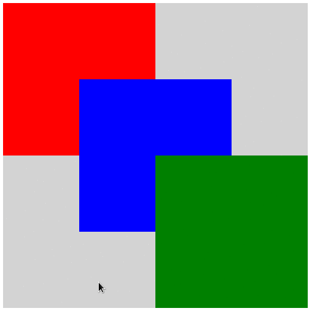

# d3-cooltip

> An easy-to-use reusable tooltip plugin for d3v4



[](https://github.com/BastiTee/d3-cooltip/releases/latest)
[](https://bl.ocks.org/BastiTee/812b6d13f1e01b02cdcf1444f56505d1)

## Main features

- Easy-to-use programming interface
- Border detection to keep cooltips inside parent DIV/SVG
- Multi-line support


## Usage

Include library in your header. d3v4 is required as well.

```html
<script src="https://d3js.org/d3.v4.js"></script>
<script src="https://cdn.rawgit.com/BastiTee/d3-cooltip/releases/download/0.1.0/d3-cooltip.min.js"></script>
```

Write a selector callback to define what the cooltip should display from your data. You can use `\n`-style linebreaks.

```javascript
var cooltipText = function(d) {
    return "This rectangle is\ncolored " + d["value"]
}
```

Then create a new cooltip instance and configure it programmatically.

```javascript
var cooltip = d3.cooltip()
    .opacity(0.7)
    .padding(10) 
    .color("lightgrey")
    .fill("black")
    .roundCorners(10)
    .lineHeight(25)
    .selector(cooltipText)
```

Check out the [documented source file](src/index.js) to learn about possible options. 
You can style cooltips via CSS as well.

```css
<style>
    @import url('https://fonts.googleapis.com/css?family=Saira+Extra+Condensed');
    .cooltip-box {
        /* The box around the cooltip text */
        stroke: orange;
        stroke-width: 2;
    }
    .cooltip-text {
        /* The cooltip text */
        font-family: 'Saira Extra Condensed', sans-serif;
        font-size: 150%;
    }
</style>
```

Finally invoke a function call for any element you want to provide with your cooltip.

```javascript
svg.selectAll(".rectangles").call(cooltip)
```

A complete [example](example/) is contained inside this repository. You can run it with..

```shell
npm install
sudo npm install -g http-server
http-server
```

.. and then opening <http://127.0.0.1:8080/example/> in your browser.

## License

Code is licensed under [Apache License Version 2.0](LICENSE).
